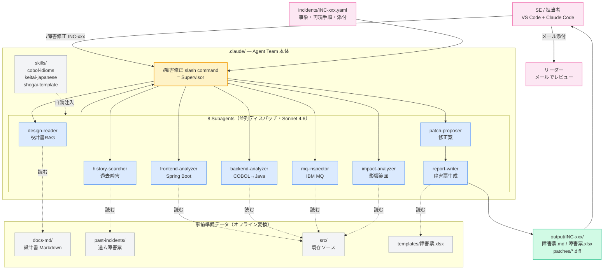
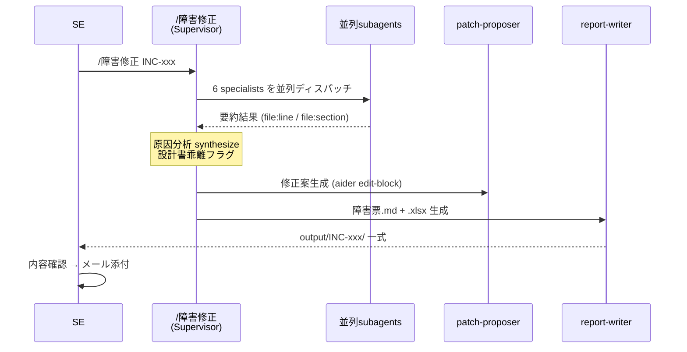

# 障害修正 Agent Team

> Claude Code (VS Code) ネイティブの multi-agent システムで、レガシー（Spring Boot + COBOL→Java + IBM MQ）の障害対応を支援。
> **設計書調査 → 前後コード解析 → MQ 通信解析 → 影響範囲・過去類似 → 修正案 → 障害票（事象/分析/対策）生成** までを `/障害修正 INC-xxx` の一発コマンドで実行。

---

## 全体アーキテクチャ



---

## なぜこの形か

VS Code 上の Claude Code（Sonnet 4.6 のみ）で運用する前提。LangGraph などの独自フレームワークは構築せず、**Claude Code 標準の subagent / slash command / skill / settings** を組み合わせる。

メリット:
- 追加サーバ・新フレームワーク学習ゼロ
- VS Code 内で完結、SE が普段の作業フローで起動
- 全 subagent が Sonnet 4.6 で統一
- subagent 間の並列ディスパッチ・コンテキスト分離は Claude Code が担当
- `.claude/` ごと Git にコミット → チーム共有・バージョン管理が自然

対象システム:
- **Frontend**: Spring Boot (Java)
- **Backend**: COBOL→Java 変換コード
- **連携**: IBM MQ
- **設計書**: ローカル Word/Excel/PDF（事前 Markdown 化）

---

## 配布物の構成

```
agent-team-fault-diagnosis/
├── README.md                       ← 本ファイル
├── docs/
│   ├── architecture.md             ← 詳細アーキ（Mermaid 図 4 枚）
│   ├── workflow.md                 ← ワークフロー + 入出力サンプル
│   ├── agents.md                   ← 8 subagent 仕様詳細
│   └── setup.md                    ← 導入手順
├── examples/
│   ├── .claude/                    ← legacy app repo にコピーするテンプレ
│   │   ├── commands/障害修正.md
│   │   ├── agents/*.md             ← 8 subagent
│   │   ├── skills/*/SKILL.md       ← 3 skill
│   │   └── settings.json
│   ├── scripts/                    ← オフライン補助
│   │   ├── ingest_docs.py
│   │   ├── ingest_history.py
│   │   └── fill_template.py
│   ├── incidents/INC-SAMPLE-001.yaml
│   └── output/INC-SAMPLE-001/      ← 想定出力サンプル
└── CHANGELOG.md
```

`agent-team-fault-diagnosis/` を **配布 kit** 兼 **テンプレ集** として扱い、SE はコピーして自分の legacy app repo に展開する。

---

## クイックスタート

詳細は [docs/setup.md](docs/setup.md) を参照。

```bash
# 1. legacy app repo に kit をコピー
cp -r agent-team-fault-diagnosis/examples/.claude   <legacy-app-repo>/
cp -r agent-team-fault-diagnosis/examples/scripts   <legacy-app-repo>/
mkdir -p <legacy-app-repo>/{docs-md,past-incidents,incidents,output,templates}
cp 障害票_template.xlsx <legacy-app-repo>/templates/

# 2. 設計書を Markdown 化
cd <legacy-app-repo>
pip install docling openpyxl pyyaml
python scripts/ingest_docs.py    ./設計書/
python scripts/ingest_history.py ./過去障害票/

# 3. VS Code を開いて Claude Code を起動 → 入力
/障害修正 INC-202604-001
```

---

## ワークフロー（要約）



詳細フロー・入出力サンプルは [docs/workflow.md](docs/workflow.md)。

---

## 8 つの subagent

| # | name | 責務 |
|---|---|---|
| 1 | **design-reader** | 設計書 Markdown から関連箇所を抽出（`file:section` 引用） |
| 2 | **frontend-analyzer** | Spring Boot 側のフロー解析 |
| 3 | **backend-analyzer** | COBOL→Java 変換コード解析（cobol-idioms skill 活用） |
| 4 | **mq-inspector** | IBM MQ queue 定義・電文 layout・送受信コード突合 |
| 5 | **impact-analyzer** | 影響範囲（caller/callee） |
| 6 | **history-searcher** | 過去類似 障害票 検索 |
| 7 | **patch-proposer** | aider edit-block 形式で修正案生成 |
| 8 | **report-writer** | 障害票.md + 障害票.xlsx 生成（敬体厳守） |

詳細は [docs/agents.md](docs/agents.md)。

---

## 落とし穴と guardrail

| # | 注意点 | 対策 |
|---|---|---|
| 1 | 設計書 vs 実装乖離 | supervisor プロンプトに乖離発見時の明示指示、専用セクション |
| 2 | subagent context 爆発 | 要約のみ返却、コード断片は file:line 参照 |
| 3 | リファクタ暴走 | `bug_scope_only` 制約、COBOL idiom 維持 |
| 4 | 敬体崩れ・英語混入 | `keitai-japanese` skill + 二重チェック |
| 5 | DB/MQ 触る patch | `[要レビュー注意]` バッジ自動付与 |
| 6 | PII 漏洩 | past-incidents 投入前に offline でマスキング |
| 7 | 設計書 hallucination | 引用は `file:section` 必須、不明時は「未記載」と明記 |

---

## 参考にした GitHub プロジェクト

実装は Claude Code 原生で行うが、設計思想を以下から借用：

- [paul-gauthier/aider](https://github.com/paul-gauthier/aider) — edit-block patch format
- [FoundationAgents/MetaGPT](https://github.com/FoundationAgents/MetaGPT) — 構造化文書ベースの agent 通信
- [Azure-Samples/Legacy-Modernization-Agents](https://github.com/Azure-Samples/Legacy-Modernization-Agents) — COBOL→Java agent role 設計
- [DS4SD/docling](https://github.com/DS4SD/docling) — 設計書 ingestion
- [anthropics/claude-code](https://docs.claude.com/claude-code) docs — subagent / slash command / skill 仕様

---

## ライセンス

社内利用前提。詳細は別途。

## 変更履歴

[CHANGELOG.md](CHANGELOG.md) 参照。
