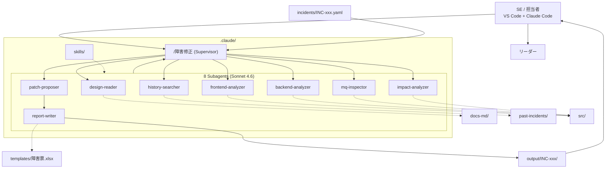
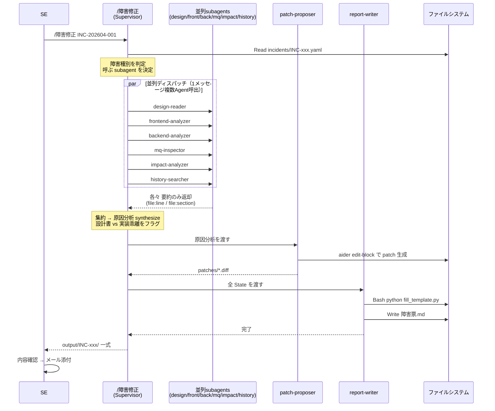
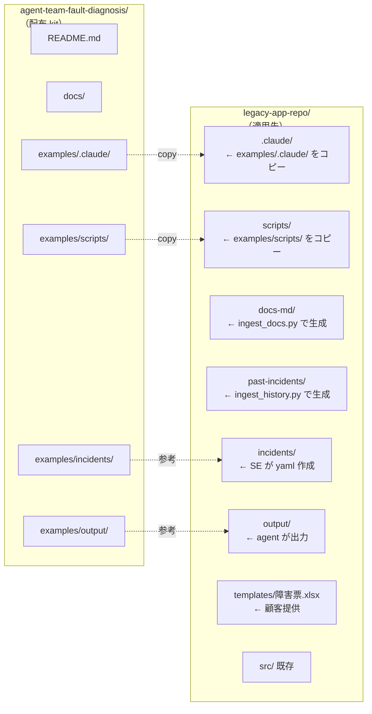
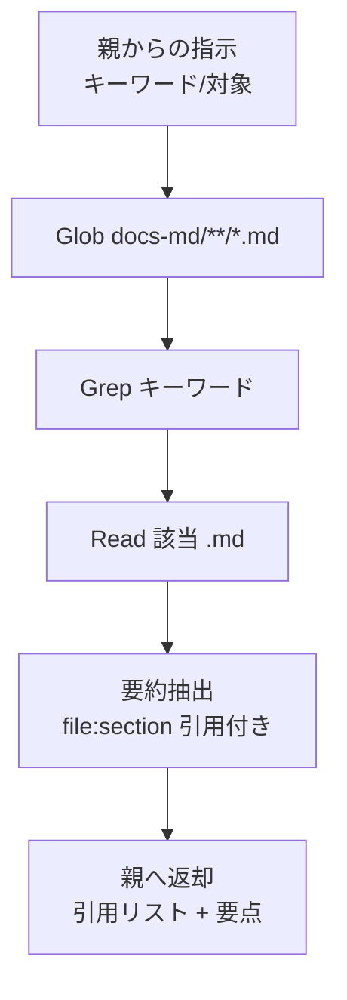

# アーキテクチャ詳細

本ドキュメントは agent team の内部構造を 4 つの Mermaid 図で示します。

---

## 図1: 全体アーキテクチャ

[README.md](../README.md) 冒頭と同一。SE / Supervisor / 8 Subagents / データソース / 出力 / リーダーレビュー の関係を一目で把握できる。

---

## 図2: 実行シーケンス

`/障害修正 INC-xxx` を実行した時の時間軸。並列ディスパッチがポイント。

並列ディスパッチは Claude Code の Agent ツールを 1 メッセージ内で複数回呼び出すことで実現。最大 ~10 並列。

---

## 図3: ディレクトリ配置（kit ↔ 適用先）

`agent-team-fault-diagnosis/examples/` の中身を legacy app repo にコピーする。kit 自体は方案・サンプル集として独立。

---

## 図4: subagent 内部処理（design-reader 例）

各 subagent は **separate context window** を持ち、与えられたタスクを Tools で完遂、要約結果のみ親に返す。

他 subagent も同パターン:
- **frontend-analyzer / backend-analyzer / mq-inspector / impact-analyzer**: `src/` を Glob/Grep/Read
- **history-searcher**: `past-incidents/` を Glob/Grep/Read
- **patch-proposer**: 上記 subagent 結果から Edit ツールで diff を生成、`git diff` で確認
- **report-writer**: 全結果を Markdown 化、`python fill_template.py` で xlsx 出力

---

## モデル配置

| シーン | モデル | 理由 |
|---|---|---|
| Supervisor | Sonnet 4.6 | VS Code 制約。routing も synthesis も Sonnet |
| 全 subagent | Sonnet 4.6 | 統一。フレームワーク制約だが、本ユースケースには十分 |

将来 API 経由で Opus 4.7 が利用可能になった場合は `patch-proposer` と原因分析 synthesis のみ Opus 化を検討。

---

## State の表現

LangGraph の Pydantic State 相当のものは **存在しない**。代わりに **Claude Code の親 context window** がそのまま State の役割を果たす:

- subagent 結果は親メッセージ履歴に蓄積
- 親（Supervisor）は履歴を見ながら次のステップを決定
- 障害票.md / .xlsx 生成時は report-writer に履歴の要約を渡す

これは **MetaGPT 風の構造化文書通信** とは異なるが、Sonnet 4.6 の長文脈（200K）で十分実用に耐える。

---

## 拡張ポイント

- **新 subagent 追加**: `examples/.claude/agents/<name>.md` を作るだけ
- **新 skill 追加**: `examples/.claude/skills/<name>/SKILL.md`
- **MCP server 連携**: 例えば JIRA や Backlog の障害チケット自動取得を追加するなら MCP server を `.mcp.json` で追加
- **多言語化**: skills/keitai-japanese を別言語版に差し替え可能

---

## 関連文書

- [workflow.md](workflow.md) — ワークフロー詳細と入出力サンプル
- [agents.md](agents.md) — 各 subagent の仕様
- [setup.md](setup.md) — 導入手順
