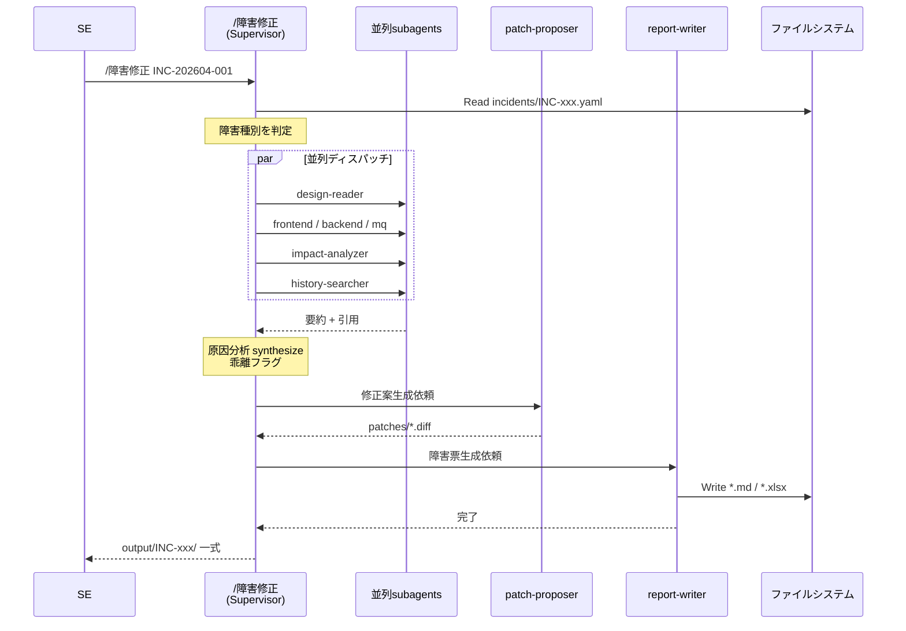

# ワークフロー詳細

---

## 全体フロー



---

## 障害種別と subagent 起動パターン

Supervisor は incident yaml の `phenomenon` `related_screens` `related_queues` から種別を判定して呼ぶ subagent を選ぶ:

| 種別 | 必ず呼ぶ | 加えて呼ぶ |
|---|---|---|
| 画面表示・入力バグ | design-reader, frontend-analyzer, impact-analyzer, history-searcher | (バックエンド連携あれば backend-analyzer) |
| 業務処理・バッチ異常 | design-reader, backend-analyzer, impact-analyzer, history-searcher | (DB/MQ 関連なら mq-inspector) |
| MQ タイムアウト・通信異常 | design-reader, mq-inspector, backend-analyzer, impact-analyzer, history-searcher | frontend-analyzer (送信元判定用) |
| 性能劣化 | design-reader, backend-analyzer, mq-inspector, impact-analyzer, history-searcher | (DB SQL 含む) |
| 全パターン共通 | impact-analyzer, history-searcher | — |

---

## 入力フォーマット

### `incidents/INC-202604-001.yaml`

```yaml
incident_id: INC-202604-001
title: 受注照会画面で得意先コード10桁入力時にタイムアウト
reported_by: 山田太郎
reported_at: 2026-04-15 10:23
severity: 高              # 高 / 中 / 低

phenomenon: |
  受注照会画面（URL: /order/inquiry）で得意先コード欄に10桁入力すると
  約60秒後にタイムアウトエラー。9桁以下では正常動作。

repro_steps:
  - "受注照会画面を開く"
  - "得意先コード欄に '1234567890' を入力"
  - "「照会」ボタン押下"
  - "60秒後 java.net.SocketTimeoutException が発生"

attachments:
  - logs/app-2026-04-15.log
  - screenshots/timeout.png

related_screens: ["受注照会"]
related_queues: ["ORDER.INQUIRY.REQ", "ORDER.INQUIRY.RES"]

# 任意フィールド
known_workaround: "9桁までで運用回避"
business_impact: "営業部門 30 名が照会業務不可"
```

---

## 出力フォーマット

### `output/INC-202604-001/障害票.md`

8 セクション構成:

```markdown
# 障害票 INC-202604-001

## 1. 発生事象
- 日時: 2026-04-15 10:23
- 報告者: 山田太郎
- 重要度: 高
- 影響: 営業部門 30 名が照会業務不可
（事象記述）

## 2. 再現手順
1. 受注照会画面を開く
2. ...

## 3. 関連設計書
- `docs-md/受注機能_詳細設計書/03-受注照会.md:section-2.3` 「得意先コード桁数」
- ...

## 4. 関連コード箇所
- `src/main/java/com/example/order/OrderInquiryController.java:45` リクエスト受付
- ...

## 5. 原因分析
（synthesis 結果）

### 設計書 vs 実装乖離
- [あり] 設計書では 9 桁固定だが実装は 10 桁を許容
- ...

## 6. 影響範囲
- caller: ...
- callee: ...

## 7. 対策案
### 案 A（推奨）
（説明 + patch 抜粋）
### 案 B
...

## 8. 推奨案と次アクション
- 推奨: 案 A
- レビュー観点: DB アクセスを変更するため [要レビュー注意]
```

### `output/INC-202604-001/障害票.xlsx`

`templates/障害票_template.xlsx` を fill-in。テンプレが顧客提供なら named range を尊重、無ければ固定セル番地で書き込む（`fill_template.py` 設定）。

### `output/INC-202604-001/patches/`

```
patches/
├── 案A-OrderInquiryController.diff
├── 案A-OrderInquiryService.diff
└── 案B-validation-only.diff
```

aider edit-block 形式の `.diff` ファイル。直接 `git apply` 可能。

### `output/INC-202604-001/evidence/`

参照した設計書の該当ページ（PDF 抜粋）、ログ抜粋などの根拠ファイル。Markdown 障害票 から相対パスで参照。

---

## エラー時の挙動

| ケース | 挙動 |
|---|---|
| `incidents/INC-xxx.yaml` 不存在 | Supervisor が SE に作成を促す |
| `docs-md/` 空 | design-reader が「設計書未投入、ingestion 必要」を返す |
| subagent タイムアウト | 該当 subagent の結果欄に「未取得」と記載、他は続行 |
| patch-proposer が複数案出せない | 案 A のみで進行、推奨案セクションにその旨記載 |
| `templates/障害票.xlsx` 不存在 | `.xlsx` 出力スキップ、`.md` のみ出力。SE に通知 |

---

## 実行ログ

Claude Code の transcript 機能で全 LLM/tool 呼出が自動保存される。再現性が必要な場合は VS Code の Claude Code session を export。

---

## 関連文書

- [agents.md](agents.md) — 各 subagent の詳細仕様
- [setup.md](setup.md) — 導入手順
